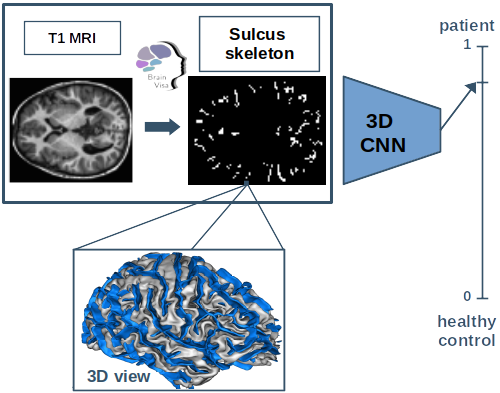

<div align="center">

# Supervised diagnosis prediction from cortical sulci
*toward the discovery of neurodevelopmental biomarkers in mental disorders*

</div>

## Introduction

This repository contains the experiments described in _Supervised diagnosis prediction from cortical sulci : toward the discovery of neurodevelopmental biomarkers in mental disorders_, presented at 21th IEEE ISBI 2024.

The paper can be found [here](/https://hal.science/hal-04494994/document).

<div align="center">
    
</div>

> **Abstract:** *Recent advances in machine learning applied to structural magnetic resonance imaging (sMRI) may highlight abnormalities in brain anatomy associated with mental disorders. These disorders are multifactorial, resulting from a complex combination of neurodevelopmental and environmental factors. In particular, such factors are present in cortical sulci, whose shapes are determined very early in brain development and are a valuable proxy for capturing specifically the neurodevelopmental contribution of brain anatomy. This paper explores whether the shapes of cortical sulci can be used for diagnosis prediction using deep learning models. These models are applied to three mental disorders (autism spectrum disorder, bipolar disorder, and schizophrenia) in large multicentric datasets. We demonstrate that the neurodevelopmental underpinnings of these disorders can be captured with sMRI. Finally, we show the potential of visual explanations of models’ decisions in discovering biomarkers for mental disorders.*

The goal is to predict diagnosis from cortical sulcus images for three mental disorders :
* Healthy Control (HC) vs Autism Spectrum Disorder (ASD)
* Healty Control (HC) vs Bipolar Disorder (BD)
* Healthy Control (HC) vs Schizophrenia (SCZ)

## Running experiments

### Installation
To install the package, clone the repository into a folder and then :
``` Shell
cd /path/to/diag_pred_from_sulci
pip install -e .
```

### Datasets

The 3 clinical datasets `SCZDataset`, `BDDataset` and `ASDDataset` are derived mostly from public cohorts excepted for 
BIOBD, BSNIP1 and PRAGUE, that are private for clinical research. Here, the phenotyp information of each dataset :

**Dataset** | **# Subjects** | **Age** (avg±std) | **Sex (\%F)** | **# Sites** | **Studies**
| :---:| :---: | :---: | :---: | :---: | :---: |
HC<br>SCZ | 761<br>532 | 33 ± 12<br>34 ± 12 | 51<br>29 | 12 | [BSNIP1](http://b-snip.org), [CANDI](https://www.nitrc.org/projects/candi_share), [CNP](https://www.ncbi.nlm.nih.gov/pmc/articles/PMC5664981/),   PRAGUE, [SCHIZCONNECT](http://schizconnect.org)
HC<br>BD | 695<br>469 | 37 ± 14<br>39 ± 12 | 54<br>57 | 15 | [BIOBD](https://pubmed.ncbi.nlm.nih.gov/29981196/), [BSNIP1](http://b-snip.org), [CANDI](https://www.nitrc.org/projects/candi_share), [CNP](https://www.ncbi.nlm.nih.gov/pmc/articles/PMC5664981/)
HC<br>ASD | 926<br>813 | 16 ± 9<br>16 ± 9 | 25<br>13 | 30 | [ABIDE I](http://fcon_1000.projects.nitrc.org/indi/abide/abide_I.html) , [ABIDE II](http://fcon_1000.projects.nitrc.org/indi/abide/abide_II.html)

To run experiments, you need a `root` folder containing :
- the pickles of train-val-test schemes for each dataset
- the mapping of acquisition sites
- a folder `morphologist` with arrays of skeleton volumes and corresponding participant dataframes of each study

### Launch model trainings

To launch model trainings, you need to launch the python script `main.py` in the `dl_training` folder.
All the parameters to be passed into argument are explained in the script.
``` Shell
python3 dl_training/main.py --args
# if you need details about parameters
python3 dl_training/main.py --help
```

### Experiments

1. Architecture selection : 3 CNN architectures have been tested, see the `architecture` folder
2. Loss selection : BCE and SupCon losses have been compared, see `contrastive_learning` folder for SupCon model
3. Pre-processing selection : Gaussian smoothing pre-processing, see `img_preprocessing` folder
4. XAI : an occlusion method have been applied to understand model decisions, see `saliency_map` folder

## Citation
If you find this work useful for your research, please cite our [paper](https://hal.science/hal-04494994):
```
@inproceedings{Auriau:2024,
author={Pierre Auriau and Antoine Grigis and Benoit Dufumier and Robin Louiset and Joel Chavas and Pietro Gori and Jean-François Mangin and Edouard Duchesnay},
title={Supervised diagnosis prediction from cortical sulci: toward the discovery of  neurodevelopmental biomarkers in mental disorders},
booktitle={21st IEEE International Symposium on Biomedical Imaging (ISBI 2024)},
year={2024}
}
```
## Useful links
* Link to the paper : <https://hal.science/hal-04494994>
* First version of these scripts are at: <https://github.com/Duplums/SMLvsDL>
* More info of Brainvisa, software to extract cortical sulci from MRI images, at : <https://brainvisa.info/web/>
